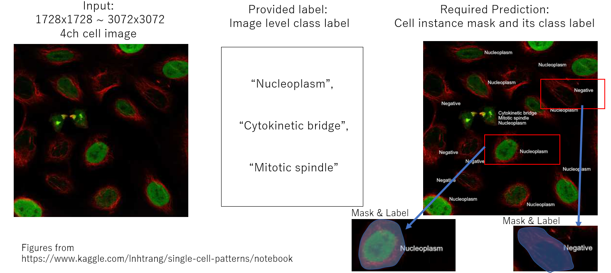
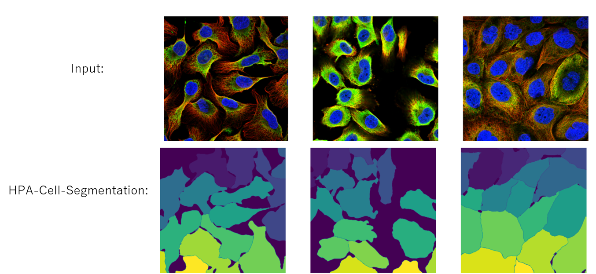
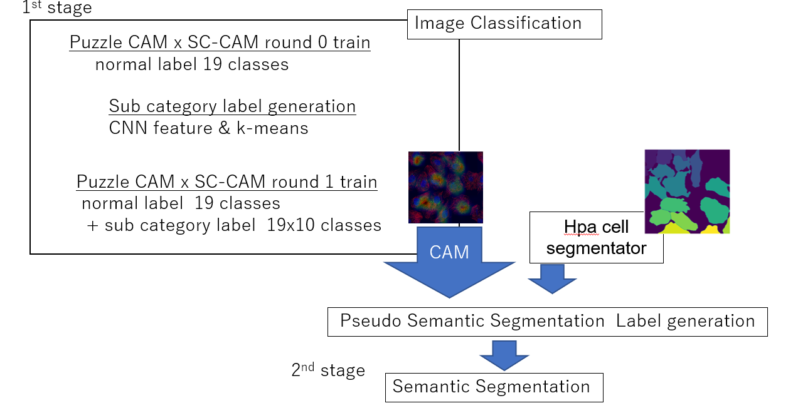

# kaggle hpa-single-cell-image-classification
[](https://pycqa.github.io/isort/)
[](https://github.com/psf/black)


## Description
The 15th place solution training code for Kaggle competition, [Human Protein Atlas - Single Cell Classification](https://www.kaggle.com/c/hpa-single-cell-image-classification)
The task of this competition is a weakly instance segmentation for protein class like below.


But we have a tool, [HPA-Cell-Segmentation](https://github.com/CellProfiling/HPA-Cell-Segmentation), which segment cell not classify protein. That's why we can only predict class for each mask if we rely on this tool.
.


## approach
2 stages approach

- 1 st stage: CAM x [SC-CAM](https://arxiv.org/abs/2008.01183) generation
- 2 nd stage: Semantic Segmentation with the pseudo label from CAM



## How to run
### Data Preparation
First, download the data, [here](https://www.kaggle.com/c/hpa-single-cell-image-classification/data)
and if you want to use additional data you need [this data](https://www.kaggle.com/philculliton/hpa-challenge-2021-extra-train-images) and [this csv](https://www.kaggle.com/sai11fkaneko/hpa-extra-data-info).
For hpa segmentation tool, pretrained weights are needed. You can get these weights, [here](https://github.com/CellProfiling/HPA-Cell-Segmentation).
To run this code, the following configuration is expected.
```bash
../input/
    │
    ├ hpa-single-cell-image-classification/
    ├ hpa-challenge-2021-extra-train-images/
    ├ publichpa-withcellline_processed.csv
    └ hpa-cell-seg-weights
        ├ nuclei-model.pth
        └ cell-model.pth
```
### Package Installation
```bash
# clone project
git clone https://github.com/Fkaneko/kaggle_2021_hpa_single_cell_classification

# install project
cd kaggle_2021_hpa_single_cell_classification
pip install -r requirements.txt
pip install https://github.com/CellProfiling/HPA-Cell-Segmentation/archive/master.zip
 ```

### 1st Stage Run
```bash
LOG_DIR="./"
NUM_WORKERS=16

TIMM=resnet50
EPOCHS=1
DATA_DIR=../input/hpa-single-cell-image-classification
INPUT_SIZE=512

# 1st SC-CAM round 0
EXT_MODE=0
ROUND_NB=0
python run_classification.py \
    --gpu 1 \
    --max_epochs $EPOCHS \
    --val_fold 0 \
    --batch_size 40 \
    --data_dir ${DATA_DIR} \
    --timm_model_name $TIMM \
    --benchmark  \
    --precision 16 \
    --optim_name sgd \
    --round_nb  ${ROUND_NB} \
    --aug_mode 1 \
    --default_root_dir ${LOG_DIR} \
    --num_workers ${NUM_WORKERS} \
    --num_inchannels 4 \
    --use_ext_data \ # assume using extra data
    --ext_data_mode ${EXT_MODE} \
    --input_size ${INPUT_SIZE} \
    --lr 0.5
```
After this SC-CAM round 0 training, for round 1, using the trained weight of round 0,
sub-category is generated and moving on to round 1 like below.
```bash
ROUND_NB=1
CKPT_PATH=`ls ${LOG_DIR}/lightning_logs/version_0/checkpoints/epoch*` # need to change
SUB_LABEL_DIR="./save_uni"
mkdir $SUB_LABEL_DIR
python ./extract_feature.py \
    --weights $CKPT_PATH \
    --save_folder ${SUB_LABEL_DIR} \
    --use_ext_data \ # assume using extra data
    --ext_data_mode ${EXT_MODE}

python ./create_pseudo_label.py \
    --save_folder ${SUB_LABEL_DIR} \
    --for_round_nb $ROUND_NB \
    --is_scale_feature \
    --use_ext_data \ # assume using extra data
    --ext_data_mode ${EXT_MODE}

# 1st SC-CAM round 1
python run_classification.py \
    --gpu 1 \
    --max_epochs $EPOCHS \
    --val_fold 0 \
    --batch_size 40 \
    --data_dir ${DATA_DIR} \
    --timm_model_name $TIMM \
    --benchmark  \
    --precision 16 \
    --optim_name sgd \
    --round_nb  ${ROUND_NB} \
    --aug_mode 1 \
    --sub_label_dir ${SUB_LABEL_DIR} \
    --default_root_dir ${LOG_DIR} \
    --num_workers ${NUM_WORKERS} \
    --num_inchannels 4 \
    --use_ext_data \ # assume using extra data
    --ext_data_mode ${EXT_MODE} \
    --input_size ${INPUT_SIZE} \
    --lr 0.005
```

### 2nd Stage Run
After 1st stage,  moving on to pseudo semantic segmentation label generation and segmentation training.
But at this pseudo label generation, it will take ~70h ? I guess.
Because hpa segmentation tool is not fast. After the initial run, masks of hpa segmentation tool
 are going to be cached at `../input/hpa_mask/` and the processing time will reduce to ~10h.

```bash
# pseudo label generation for 2nd stage
SEGM_DIR=$SUB_LABEL_DIR
python run_cam_infer.py \
    --yaml_path ./src/config/generate_pseudo_label.yaml \ # you have to change `ckpt_paths` at this yaml
    --sub_path ${SEGM_DIR}/pseudo_label.csv

python create_segm_labels.py \
    --save_folder ${SEGM_DIR} \
    --sub_csv ${SEGM_DIR}/pseudo_label.csv

# 2nd stage semantic segmentation
SEGM_TRESH=0.225
TIMM="resnet50"
INPUT_SIZE=512
python run_classification.py \
    --gpu 1 \
    --max_epochs $EPOCHS \
    --val_fold 0 \
    --batch_size 12 \
    --benchmark  \
    --precision 16 \
    --timm_model_name ${TIMM} \
    --optim_name sgd \
    --segm_label_dir $SEGM_DIR \
    --segm_thresh $SEGM_TRESH \
    --round_nb 0 \
    --num_workers $NUM_WORKERS \
    --default_root_dir $LOG_DIR \
    --num_inchannels 4 \
    --data_dir ${DATA_DIR} \
    --use_ext_data \ # assume using extra data
    --ext_data_mode ${EXT_MODE} \
    --input_size ${INPUT_SIZE} \
    --lr 0.25
```
## how to evaluate
The label to test data is hidden so we could not evaluate a model locally.
We have to submit our model on a kaggle server.
I have used `run_cam_infer.py` for evaluation at kaggle and I shared it [here](https://www.kaggle.com/sai11fkaneko/hpa-inference/notebook).
If you want to evaluate your trained model, please change `ckpt_paths` of `src/config/kaggle_submission.yaml`.

## My best model submission
### Pipeline
Please check [my kaggle post](https://www.kaggle.com/c/hpa-single-cell-image-classification/discussion/239035) for details.

### Submission code at kaggle
[This is my kaggle submission](https://www.kaggle.com/sai11fkaneko/hpa-inference/notebook) and got, mAP 0.518, 15th place on this competition.
If you want to reproduce my training results, the easiest way is getting hyperparamters from [classification models](https://www.kaggle.com/sai11fkaneko/lightning-weights) 
and [semantic segmentation models](https://www.kaggle.com/sai11fkaneko/hpa-seg-weight). After downloading these datasets you can get all hyperparameters for each model like below and these hyperparamters can be used for reproducing the same training configuration.
```python
from src.modeling.pl_model import LitModel, load_trained_pl_model
checkpoint_path = "lightning-weights/rst50_1024_r0_ext1_val1/version_68/checkpoints/epoch-24-step-82924.ckpt"
_, args_hparams = load_trained_pl_model(LitModel, checkpoint_path=checkpoint_path, only_load_yaml=True)
```
Also each hyperparameter is checked with `tensorborad`. But there are so many parameters, it's hard to check with tensorborad...
```bash
# download https://www.kaggle.com/sai11fkaneko/lightning-weights
tensorborad --logdir ./lightning-weights
# now starting tensorborad, and `HPARAMS` tab is available
```

## License
#### Code
Apache 2.0

#### Dataset and pretrained weights
At least please check, https://www.proteinatlas.org/about/licence.
And this kaggle competition, some data may be independent from this site.
So if you use this data in a serious case, you had better to confirm your case with the competition host.
And the license of my pretarined weights are supposed to be the same as the dataset license.


## Reference
* [competition page](https://www.kaggle.com/c/hpa-single-cell-image-classification)
* SC-CAM,  https://github.com/Juliachang/SC-CAM
* PuzzleCAM, https://github.com/OFRIN/PuzzleCAM
